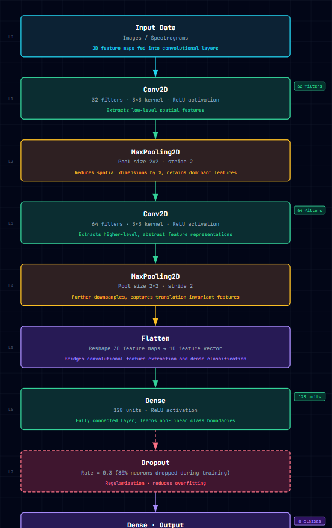
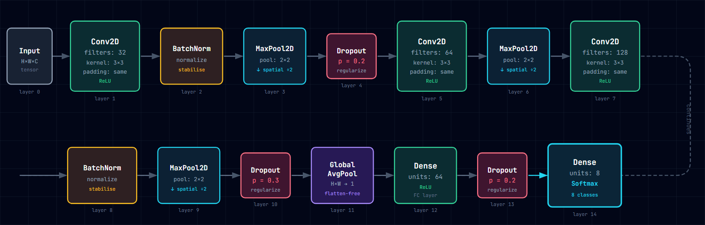
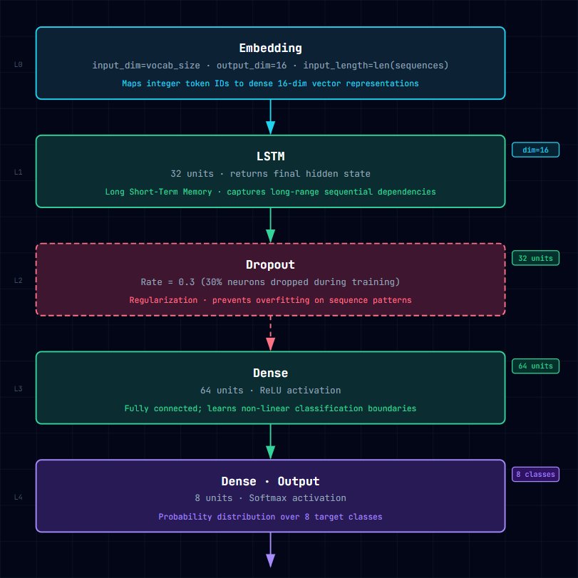
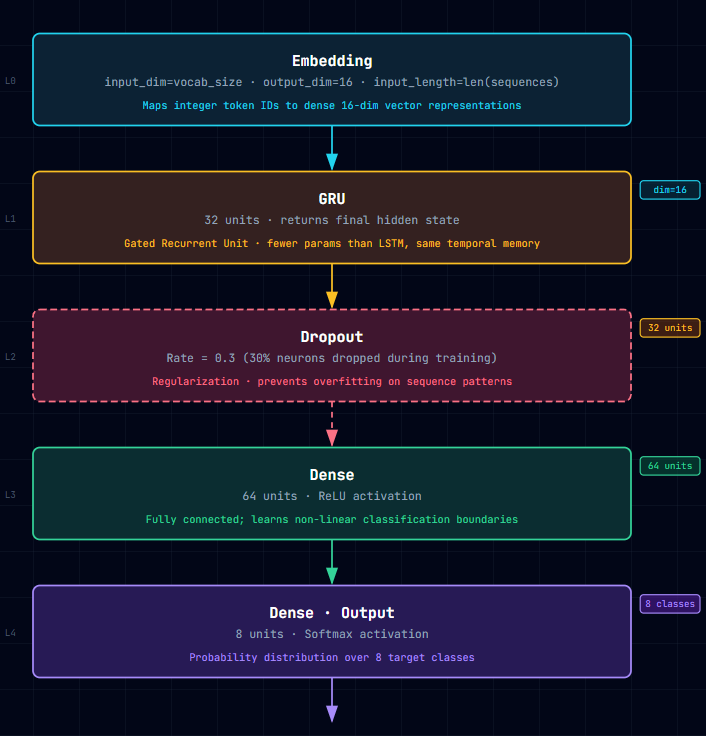
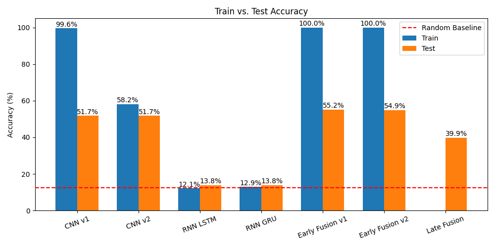
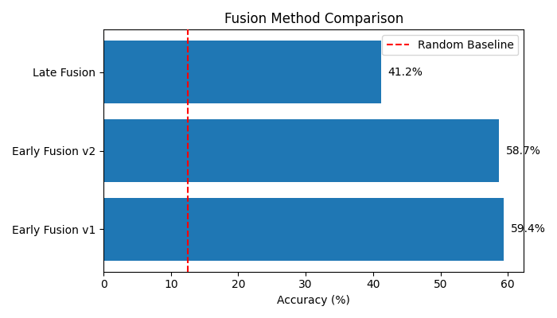

# Multimodal Emotion Recognition using Audio and Text

## Objective

The objective of this project was to design and train a multimodal deep learning system capable of classifying human emotions using both:

- Audio information extracted from speech recordings
- Text information generated through speech-to-text transcription

The dataset used for this task was the RAVDESS Emotional Speech dataset.

The emotion classes were:

1. Neutral  
2. Calm  
3. Happy  
4. Sad  
5. Angry  
6. Fearful  
7. Disgust  
8. Surprised  

# Methodology

The project was divided into three major stages:

1. Audio-based emotion recognition using CNN
2. Text-based emotion recognition using RNN
3. Multimodal fusion of both modalities

---

# CNN Architectures

## CNN v1

The architecture diagram is as follows:



### Results

Training Accuracy: 0.9766
Test Accuracy: 0.4965

### Observation

This model achieved extremely high training accuracy but poor testing accuracy, indicating severe overfitting.

---

## CNN v2

To reduce overfitting, the second CNN architecture introduced:

- Batch Normalization
- Dropout
- Global Average Pooling

The architecture diagram is as follows:



### Results

Training Accuracy: 0.6319
Test Accuracy: 0.4965

### Observation

The architecture generalized slightly better and reduced excessive memorization as compared to CNN v1.

---

# RNN Architectures

Two recurrent models were tested:

- LSTM
- GRU

The architecture diagrams are as follows:





### Results

LSTM RNN:
 - Training Accuracy: 0.1280
 - Test Accuracy: 0.1402

GRU RNN:
 - Training Accuracy: 0.1315
 - Test Accuracy: 0.1402 

### Observation

The RNN architectures performed poorly, as expected, since the given dataset as expression cannot be interpreted properly using simply the text transcripts. The test accuracies are just barely better than a random guessing model!

---

# Multimodal Fusion

Two fusion approaches were explored:
 - Early Fusion
 - Late Fusion

---

## Early Fusion

1. The individual CNN and RNN models were truncated at the final layer
2. These final layers were concatenated and fed into a simple neural network of 3 layers

This allowed the model to jointly learn relationships between speech characteristics and textual information.

---

## Late Fusion

1. CNN and RNN were kept as separate models
2. Their softmax probabilities were combined during inference

Weighted averaging was used:

```math
0.9 \times Audio + 0.1 \times Text
```

since the Audio CNN is much stronger than the Text RNN.

---

# Results

| Model            | Training Accuracy | Testing Accuracy |
| ---------------- | ----------------- | ---------------- |
| CNN v1           | 0.9956            | 0.5175           |
| CNN v2           | 0.5819            | 0.5175           |
| RNN (LSTM)         | 0.1209            | 0.1376           |
| RNN (GRU)          | 0.1288            | 0.1376           |
| Early Fusion v1  | 1.0000            | 0.5524           |
| Early Fusion v2  | 1.0000            | 0.5490           |
| Late Fusion      | N/A               | 0.4125           |



